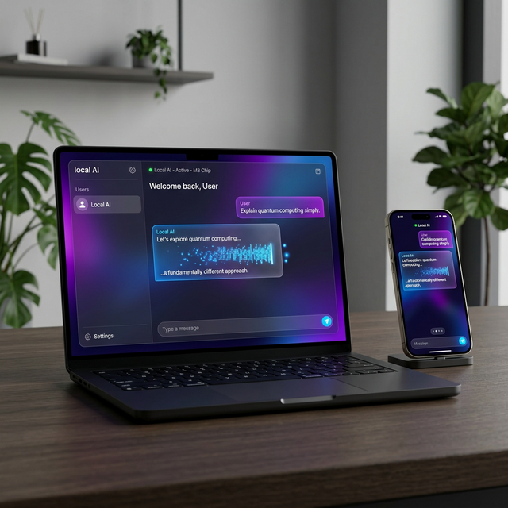

# mlx_localllm



[English](#english) | [简体中文](#简体中文)

---

<a name="english"></a>
## English

A Flutter plugin for high-performance localized LLM inference on macOS using Apple's **MLX** framework. It provides zero-latency interaction by loading models directly into the application process.

### Features
- 🚀 **Native Acceleration**: Built on Apple's MLX for optimal performance on Apple Silicon.
- 📦 **In-Process Inference**: No external sidecars or servers (like Ollama) required.
- 🌐 **Robust Downloader**: Built-in support for Hugging Face and mirrors with resilient chunk-based downloading.
- 🛠️ **Full Lifecycle**: From model discovery and download to stateful conversational inference.

### Platform Support

| Platform | Support | Architecture | Min OS |
| :--- | :---: | :--- | :--- |
| **macOS** | ✅ | Apple Silicon (ARM64) / Intel (x86_64 Mock) | 14.0+ |
| **iOS** | ✅ | ARM64 | 17.0+ |
| **Android** | ❌ | - | - |
| **Windows** | ❌ | - | - |
| **Linux** | ❌ | - | - |
| **Web** | ❌ | - | - |

### Requirements
- **macOS**: 14.0 or higher.
- **iOS**: 17.0 or higher.
- **Hardware**: Apple Silicon (M1, M2, M3, etc.) for inference.
- **Flutter**: 3.0.0 or higher.

### Installation

1. Add the dependency to your `pubspec.yaml`:
   ```bash
   flutter pub add mlx_localllm
   ```

2. **Platform Setup**:
   The plugin uses **Swift Package Manager (SPM)** natively (requires Flutter 3.24+).
   - **macOS/iOS**: Dependencies are automatically resolved by the Flutter toolchain.
   - **Architecture**:
     - **Apple Silicon (ARM64)**: Fully supported with native MLX acceleration.
     - **Intel (x86_64)**: Supported via **Mocking**. You can compile and link on Intel Macs, but inference calls will return an "Unsupported architecture" error. This allows for seamless development across different Mac architectures.

### Usage

#### Check Support
```dart
bool supported = await MlxLocalllm().isSupported();
```

#### Download Model
```dart
// Track progress via modelEvents stream
MlxLocalllm().modelEvents.listen((event) {
  if (event['event'] == 'progress') {
    print('Download progress: ${event['progress'] * 100}%');
  } else if (event['event'] == 'complete') {
    print('Download complete at ${event['path']}');
  }
});

await MlxLocalllm().downloadModel('mlx-community/Qwen2.5-0.5B-Instruct-4bit');
```

#### Run Inference
```dart
await MlxLocalllm().loadModel('mlx-community/Qwen2.5-0.5B-Instruct-4bit');
String response = await MlxLocalllm().generate(prompt: 'Hello, who are you?');
print(response);

#### Advanced Configuration
Align with official standards (Qwen/OpenAI):
```dart
final result = await MlxLocalllm().generate(
  prompt: 'Write a poem',
  config: GenerateConfig(
    temperature: 0.7,
    topP: 0.95,
    presencePenalty: 1.5,
    // Pass custom parameters to the chat template/tokenizer
    extraBody: {
      "top_k": 20,
      "chat_template_kwargs": {"enable_thinking": true}
    },
  ),
);
```

#### Thinking Mode (Reasoning)
For models like Qwen3.5 that support a reasoning process, you can enable it via `chat_template_kwargs`:
- **Show Reasoning**: Set `enable_thinking: true`. The output will include `<think>` tags.
- **Hide Reasoning**: Set `enable_thinking: false`.

// Streaming Inference (Typewriter effect)
final stream = MlxLocalllm().generateStream(prompt: 'Write a poem about the sea.');
await for (final text in stream) {
  print(text); // Prints chunks as they are generated
}
```

---

<a name="简体中文"></a>
## 简体中文

基于 Apple **MLX** 框架的 macOS/iOS 高性能本地大模型推理 Flutter 插件。通过将模型直接加载到应用进程中，提供零延迟的交互体验。

### 特性
- 🚀 **原生加速**: 基于 Apple MLX 针对 Apple Silicon 芯片深度优化。
- 📦 **进程内推理**: 无需安装 Ollama 等外部服务，零延迟通信。
- 🌐 **鲁棒下载器**: 内置分块下载机制，支持 Hugging Face 及其镜像站。
- 🛠️ **多平台支持**: 同时支持 macOS 和 iOS 平台。
- 💻 **架构兼容**: 支持 x86 架构 Mock 编译，确保 Intel Mac 开发者也能正常运行项目。

### 平台支持

| 平台 | 支持 | 架构 | 最低系统版本 |
| :--- | :---: | :--- | :--- |
| **macOS** | ✅ | Apple Silicon (ARM64) / Intel (x86_64 Mock) | 14.0+ |
| **iOS** | ✅ | ARM64 | 17.0+ |
| **Android** | ❌ | - | - |
| **Windows** | ❌ | - | - |
| **Linux** | ❌ | - | - |
| **Web** | ❌ | - | - |

### 系统要求
- **macOS**: 14.0 及以上。
- **iOS**: 17.0 及以上。
- **硬件**: Apple Silicon 系列芯片 (M1, M2, M3 等) 仅在这些芯片上支持推理。
- **Flutter**: 3.0.0 及以上。

### 安装指南

1. 在 `pubspec.yaml` 中添加依赖：
   ```bash
   flutter pub add mlx_localllm
   ```

2. **平台配置**:
   - **macOS/iOS**: 插件使用 Swift Package Manager (SPM) 管理 MLX 依赖。Flutter (3.24+) 会自动处理这些依赖。
   - **架构要求**: 
     - **Apple Silicon (ARM64)**: 原生支持，具备 MLX 加速。
     - **Intel (x86_64)**: 支持 **Mock 编译**。您可以在 Intel Mac 上正常编译和链接项目，但推理调用将返回“不支持的架构”错误。这极大地方便了跨架构的协同开发。

### 快速开始

#### 硬件支持检测
```dart
bool supported = await MlxLocalllm().isSupported();
```

#### 模型下载
```dart
// 通过 modelEvents 流监听进度
MlxLocalllm().modelEvents.listen((event) {
  if (event['event'] == 'progress') {
    print('下载进度: ${event['progress'] * 100}%');
  } else if (event['event'] == 'complete') {
    print('下载完成，路径: ${event['path']}');
  }
});

await MlxLocalllm().downloadModel('mlx-community/Qwen2.5-0.5B-Instruct-4bit');
```

#### 执行推理
```dart
await MlxLocalllm().loadModel('mlx-community/Qwen2.5-0.5B-Instruct-4bit');
String response = await MlxLocalllm().generate(prompt: '你好，请做下自我介绍');
print(response);

#### 进阶配置
支持向模型 Tokenizer 传递自定义参数（如思考模式）：

```dart
final result = await MlxLocalllm().generate(
  prompt: '请写一首关于秋天的诗',
  config: GenerateConfig(
    temperature: 0.7,
    topP: 0.8,
    // 通过 extraBody 传递特定于模型的参数
    extraBody: {
      "chat_template_kwargs": {"enable_thinking": true}
    },
  ),
);
```

#### 推理模式 (Thinking Mode)
对于支持推理过程的模型（如 Qwen3.5），可以通过 `chat_template_kwargs` 控制：
- **开启推理显示**：设置 `enable_thinking: true`，输出将包含原始的 `<think>` 标签。
- **关闭推理显示**：设置 `enable_thinking: false`。

// 流式推送 (打字机效果)
final stream = MlxLocalllm().generateStream(prompt: '写一首关于秋天的诗');
await for (final text in stream) {
  print(text); // 会在生成时逐步打印文本
}
```

### 许可证
MIT License.
